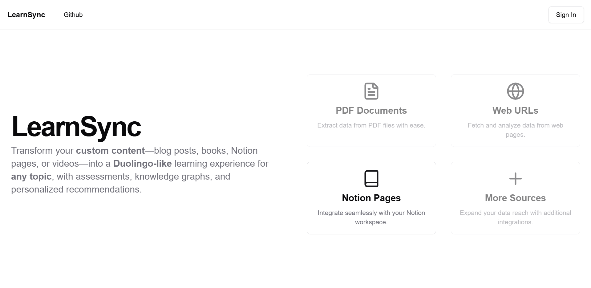

# LearnSync

Transform your custom content—blog **posts**, **PDFs**, **Notion pages**, or **videos**—into a **Duolingo-like** learning experience for **any topic**, with assessments, knowledge graphs, and personalized recommendations.

Building it in public using **Next.js**, **Vercel AI SDK**, **Upstash**, **Neo4j**, and **Neon postgres**.



## Roadmap

- [ ] Content import from multiple sources.
    - [x] Notion.
    - [x] Web Page.
    - [ ] PDF.
    - [ ] Audio.
    - [ ] Video.
- [x] Raw AI assessment generation.
- [x] Content Splitting and indexation for RAG
- [ ] Knowledge graph(semantic network).
- [ ] Assessment recommendation system.
- [ ] Lesson recommendation system.
- [ ] Adaptive lessons and questions difficulty calibration.

### Getting Started

First, install the dependencies:

```bash
npm install
# or
yarn install
# or
pnpm install
```

Set Environment variables:

```bash
cp .env.example .env
```

First, run the development server:

```bash
npm run dev
# or
yarn dev
# or
pnpm dev
# or
bun run dev
```

Open [http://localhost:3000](http://localhost:3000) with your browser to see the result.


## Contact

For questions, feedback, or collaboration opportunities, feel free to reach out to **Glody Mbutwile**.

- **Email:** glodymbutwile@gmail.com
- **Twitter:** [@glmbutwile](https://twitter.com/glmbutwile)
- **Linkedin:** [glody mbutwile](https://www.linkedin.com/in/glody-mbutwile)

---

## License

This project is licensed under the MIT License.
